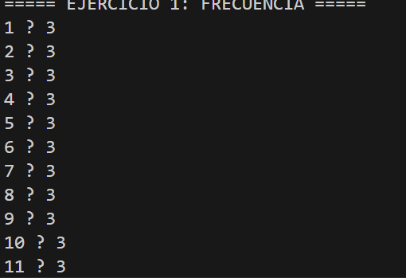
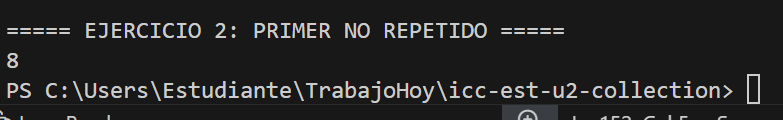
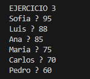
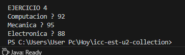

# Práctica: Estructuras No Lineales - 

## Autor
- Nombre: [Eduardo Ramon]
- Carrera/Curso: [Estructura]

##  Nombre de la práctica - Fecha
- Práctica: [Ejercicios de mapas]
- Fecha: [2025-01-19]

## Descripción
Descripción de que es lo que hizo o alcanzo desarrollar en la práctica.

## Evidencias
### Captura 1
Inserta aquí la captura del código o de la ejecución.
- Archivo: 

### Captura 2 
Inserta aquí una segunda captura si aplica.
- Archivo: 

### Captura 3
Inserta aquí una segunda captura si aplica.
- Archivo: 

### Captura 4
Inserta aquí una segunda captura si aplica.
- Archivo: 

